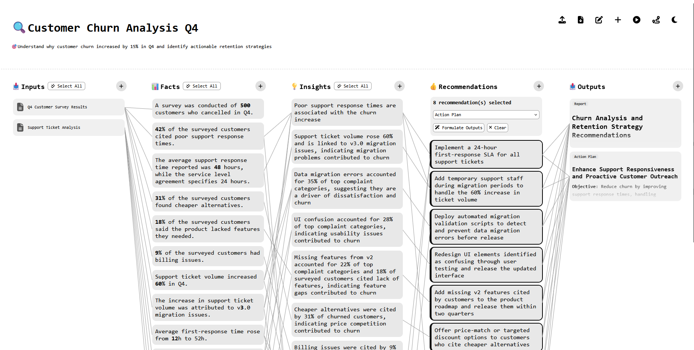

# factly

> Structured Discovery & Decision Intelligence
> Powered by the FIR method: **Facts → Insights → Recommendations**

factly is a web application designed to structure complex discovery work and turn raw information into traceable, evidence-based outcomes.

It helps teams move from uncertainty to clarity.

## 🧭 What problem does it solve?

Discovery sessions are often:

* Unstructured
* Biased by premature opinions
* Hard to trace
* Difficult to reproduce
* Lost in whiteboards or documents

factly provides a structured reasoning workspace.

**It enforces discipline:**

1. Extract **verifiable facts**
2. Derive **insights**
3. Produce **actionable recommendations**
4. Generate **clear outputs**

All fully traceable.

## 🧠 The FIR Model

factly structures discovery sessions as a reasoning pipeline:

```
Inputs → Facts → Insights → Recommendations → Outputs
```

| Entity             | Description                                                         |
| ------------------ | ------------------------------------------------------------------- |
| **Input**          | Source material (document, web page, image, video, audio, PDF, CSV) |
| **Fact**           | Verifiable statement extracted from one or more Inputs              |
| **Insight**        | Interpretation derived from one or more Facts                       |
| **Recommendation** | Actionable suggestion derived from Insights                         |
| **Output**         | Deliverable generated from Recommendations                          |

Relationships are explicit and visual.



## 🚀 Features

* 5-column discovery grid
* Visual relationship lines
* Hover highlighting
* JSON import/export
* Real-time collaboration (SSE)
* AI-assisted extraction (optional)

## 🏗 Architecture

```
apps/
  frontend/   React 18 SPA (TypeScript)
  backend/    Express API + SSE (TypeScript)
```

**Frontend**

* React 18
* TypeScript
* Visual discovery grid

**Backend**

* Express
* Server-Sent Events (real-time sessions)
* SQLite storage (Keyv)

## ⚡ Quick Start (Local Dev)

```bash
git clone https://github.com/anasdox/factly.git
cd factly
make install
make start
```

Open:

```
http://localhost:3000
```

## 🤖 Enable AI Extraction (Optional)

Create:

```
apps/backend/.env
```

```env
LLM_PROVIDER=openai-compatible
LLM_API_KEY=<your-token>
LLM_BASE_URL=https://oai.endpoints.kepler.ai.cloud.ovh.net/v1
LLM_MODEL=gpt-oss-120b
```

Supported providers:

* openai-compatible (OVHcloud, Ollama, LM Studio, Groq, Together AI, etc.)
* anthropic
* openai


## 🐳 Docker Deployment

```bash
docker compose up --build
```

Application available at:

```
http://localhost
```

To reset database:

```bash
docker compose down -v
```

## 📁 Project Structure

```
apps/backend/      Express API + SSE
apps/frontend/     React SPA
specs/functional/  Gherkin specifications
specs/technical/   OpenAPI / AsyncAPI
tests/acceptance/  Acceptance tests
```

Key documentation:

* `PROBLEM_STATEMENT.md`
* `UBIQUITOUS_LANGUAGE.md`
* `GLOBAL_TECHNICAL_ARCHITECTURE.md`
* `ROADMAP.md`
* `AGENTS.md`

## 🧪 Quality & Traceability

factly enforces structured reasoning:

* Acceptance tests
* Spec linting
* Explicit entity relationships
* Traceability from Output → Input

This makes it suitable for:

* Product discovery
* Architecture decisions
* Strategy workshops
* Internal technical reviews

## 📌 Philosophy

factly is not a whiteboard.

It is a reasoning infrastructure.

It makes:

* Assumptions explicit
* Interpretations visible
* Decisions defensible

## 🤝 Contributing

1. Fork the repository
2. Create a feature branch
3. Submit a Pull Request

Contributions are welcome.

## 📄 License

MIT License See [LICENSE](LICENSE) for details.
