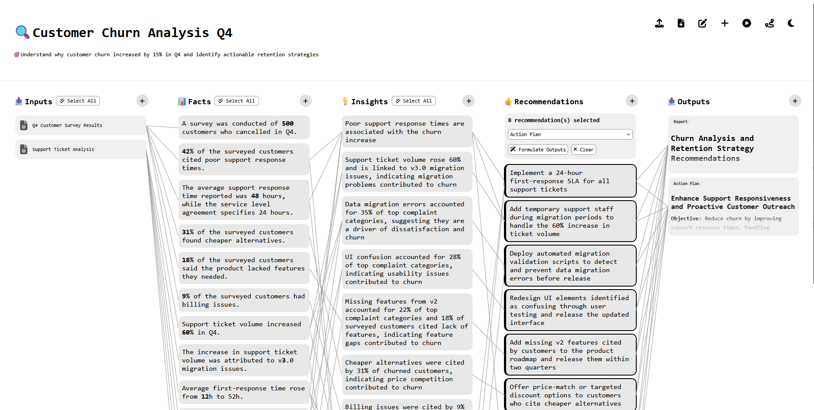

# factly

> Structured Discovery & Decision Intelligence
> Powered by the FIR method: **Facts → Insights → Recommendations**

factly is a web application designed to structure complex discovery work and turn raw information into traceable, evidence-based outcomes.

It helps teams move from uncertainty to clarity.

## 🧭 What problem does it solve?

Discovery sessions are often:

* Unstructured
* Biased by premature opinions
* Hard to trace
* Difficult to reproduce
* Lost in whiteboards or documents

factly provides a structured reasoning workspace.

**It enforces discipline:**

1. Extract **verifiable facts**
2. Derive **insights**
3. Produce **actionable recommendations**
4. Generate **clear outputs**

All fully traceable.

## 🧠 The FIR Model

factly structures discovery sessions as a reasoning pipeline:

```
Inputs → Facts → Insights → Recommendations → Outputs
```

| Entity             | Description                                                         |
| ------------------ | ------------------------------------------------------------------- |
| **Input**          | Source material (document, web page, image, video, audio, PDF, CSV) |
| **Fact**           | Verifiable statement extracted from one or more Inputs              |
| **Insight**        | Interpretation derived from one or more Facts                       |
| **Recommendation** | Actionable suggestion derived from Insights                         |
| **Output**         | Deliverable generated from Recommendations                          |

Relationships are explicit and visual.



## 🚀 Features

* 5-column discovery grid
* Visual relationship lines
* Hover highlighting
* JSON import/export
* Real-time collaboration (SSE)
* AI-assisted extraction (optional)

## 🏗 Architecture

```
apps/
  frontend/   React 18 SPA (TypeScript)
  backend/    Express API + SSE (TypeScript)
```

**Frontend**

* React 18
* TypeScript
* Visual discovery grid

**Backend**

* Express
* Server-Sent Events (real-time sessions)
* SQLite storage (Keyv)

## ⚡ Quick Start (Local Dev)

```bash
git clone https://github.com/anasdox/factly.git
cd factly
make install
make start
```

Open:

```
http://localhost:3000
```

## 🤖 Enable AI Extraction (Optional)

Create:

```
apps/backend/.env
```

```env
LLM_PROVIDER=openai-compatible
LLM_API_KEY=<your-token>
LLM_BASE_URL=https://oai.endpoints.kepler.ai.cloud.ovh.net/v1
LLM_MODEL=gpt-oss-120b
```

Supported providers:

* openai-compatible (OVHcloud, Ollama, LM Studio, Groq, Together AI, etc.)
* anthropic
* openai


## Production Deployment

### Prerequisites

- Docker and Docker Compose
- A domain name (for HTTPS)
- An LLM provider API key (OpenAI, Anthropic, or OpenAI-compatible)
- (Optional) A Brave Search API key for the web research feature

### 1. Configure environment

Copy the example and fill in your values:

```bash
cp apps/backend/.env.example apps/backend/.env
```

Edit `apps/backend/.env`:

```env
# Required
LLM_PROVIDER=openai              # or: anthropic, openai-compatible
LLM_API_KEY=sk-...               # your provider API key
JWT_SECRET=<random-64-char-string>  # MUST be unique and secret

# Optional
LLM_MODEL=gpt-4.1               # model to use (provider-specific)
SEARCH_PROVIDER=brave            # enables web research
SEARCH_API_KEY=...               # Brave Search API key
```

Generate a strong JWT secret:

```bash
openssl rand -base64 48
```

#### OpenAI-compatible providers

For self-hosted or alternative providers (OVHcloud AI Endpoints, Ollama, Groq, Together AI, LM Studio):

```env
LLM_PROVIDER=openai-compatible
LLM_API_KEY=<your-token>
LLM_BASE_URL=https://your-endpoint.example.com/v1
LLM_MODEL=your-model-name
```

### 2. Create users

Users are stored in a JSON file. Use the CLI tool to add them:

```bash
cd apps/backend
npx ts-node scripts/add-user.ts <username> <password>
```

This creates `data/users.json`. In Docker, mount or copy this file into the container, or run the command inside the running container:

```bash
docker compose exec backend node dist/scripts/add-user.js <username> <password>
```

### 3. Build and run

```bash
docker compose up --build -d
```

The application is available at `http://localhost` (port 80).

Verify the deployment:

```bash
# Backend health
curl http://localhost/health
# Expected: {"status":"ok","timestamp":"..."}

# Backend status
curl http://localhost/status
# Expected: {"searchAvailable":true}
```

### 4. HTTPS with a reverse proxy

The Docker setup serves HTTP on port 80. For production, place a TLS-terminating reverse proxy in front. Common options:

**Caddy** (automatic HTTPS with Let's Encrypt):

```
# Caddyfile
your-domain.com {
    reverse_proxy localhost:80
}
```

**Nginx + Certbot:**

```bash
sudo certbot --nginx -d your-domain.com
```

**Cloud load balancers** (AWS ALB, Cloudflare, etc.): point to port 80 and configure TLS at the load balancer level.

### 5. Data persistence and backup

All data is stored in the Docker volume `backend-data`:

- `factly.db` — SQLite database (documents, metadata)
- `users.json` — User credentials

**Backup:**

```bash
# Copy database from volume
docker compose cp backend:/app/data/factly.db ./backup-factly.db

# Or backup the entire volume
docker run --rm -v factly_backend-data:/data -v $(pwd):/backup alpine \
  tar czf /backup/factly-data-$(date +%Y%m%d).tar.gz -C /data .
```

**Restore:**

```bash
docker compose cp ./backup-factly.db backend:/app/data/factly.db
docker compose restart backend
```

### 6. Monitoring

**Health check endpoint:**

`GET /health` — returns `200 {"status":"ok"}` when the database is reachable, `503` otherwise.

Docker HEALTHCHECK is configured in both containers. Check status with:

```bash
docker compose ps
# HEALTHY / UNHEALTHY column shows container health
```

**Logs:**

```bash
# All logs
docker compose logs -f

# Backend only
docker compose logs -f backend
```

### 7. Updating

```bash
git pull
docker compose up --build -d
```

Data is preserved across rebuilds (stored in the `backend-data` volume).

### 8. Reset

To wipe all data and start fresh:

```bash
docker compose down -v
docker compose up --build -d
```

### Environment variables reference

| Variable | Required | Default | Description |
|---|---|---|---|
| `LLM_PROVIDER` | Yes | `openai` | LLM provider: `openai`, `anthropic`, `openai-compatible` |
| `LLM_API_KEY` | Yes | — | API key for the LLM provider |
| `LLM_BASE_URL` | Only for `openai-compatible` | — | Base URL of the OpenAI-compatible API |
| `LLM_MODEL` | No | Provider default | Model identifier |
| `LLM_EMBEDDINGS_MODEL` | No | — | Embedding model for semantic deduplication |
| `LLM_DEDUP_THRESHOLD` | No | `0.75` | Similarity threshold for deduplication |
| `SEARCH_PROVIDER` | No | — | Search provider (`brave`) |
| `SEARCH_API_KEY` | No | — | API key for web research |
| `JWT_SECRET` | Yes | — | Secret for signing JWT tokens |
| `JWT_EXPIRATION` | No | `24h` | Token expiration duration |
| `USERS_FILE` | No | `data/users.json` | Path to user credentials file |
| `PORT` | No | `3002` | Backend listening port |
| `CHAT_CONTEXT_THRESHOLD` | No | `50` | Max items in chat context |
| `CHAT_MAX_HISTORY` | No | `10` | Max chat messages sent to LLM |

## 📁 Project Structure

```
apps/backend/      Express API + SSE
apps/frontend/     React SPA
specs/functional/  Gherkin specifications
specs/technical/   OpenAPI / AsyncAPI
tests/blackbox/            Blackbox backend/API tests (Jest + Node)
tests/e2e/       Browser E2E acceptance tests (Playwright)
```

Key documentation:

* `PROBLEM_STATEMENT.md`
* `UBIQUITOUS_LANGUAGE.md`
* `GLOBAL_TECHNICAL_ARCHITECTURE.md`
* `ROADMAP.md`
* `AGENTS.md`

## 🧪 Quality & Traceability

factly enforces structured reasoning:

* Acceptance tests
* Spec linting
* Explicit entity relationships
* Traceability from Output → Input

This makes it suitable for:

* Product discovery
* Architecture decisions
* Strategy workshops
* Internal technical reviews

## 📌 Philosophy

factly is not a whiteboard.

It is a reasoning infrastructure.

It makes:

* Assumptions explicit
* Interpretations visible
* Decisions defensible

## 🤝 Contributing

1. Fork the repository
2. Create a feature branch
3. Submit a Pull Request

Contributions are welcome.

## 📄 License

MIT License See [LICENSE](LICENSE) for details.
