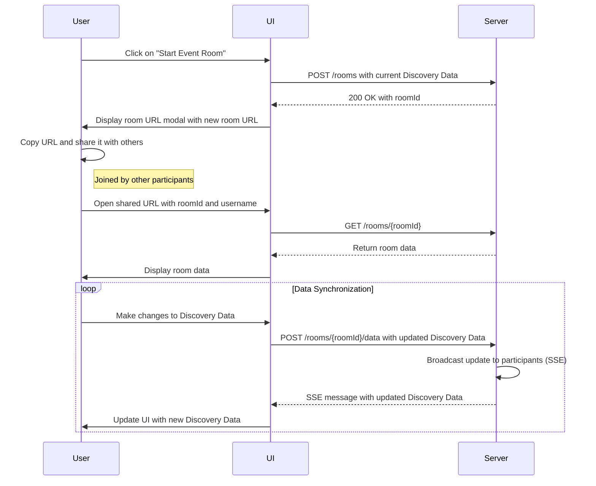

```mermaid
sequenceDiagram
    participant User
    participant UI
    participant Server

    User->>UI: Click on "Start Event Room"
    UI->>Server: POST /rooms with current Discovery Data
    Server-->>UI: 200 OK with roomId 
    UI->>User: Display room URL modal with new room URL
    User->>User: Copy URL and share it with others

    Note right of User: Joined by other participants

    User->>UI: Open shared URL with roomId and username
    UI->>Server: GET /rooms/{roomId}
    Server-->>UI: Return room data
    UI->>User: Display room data

    loop Data Synchronization
        User->>UI: Make changes to Discovery Data
        UI->>Server: POST /rooms/{roomId}/data with updated Discovery Data
        Server->>Server: Broadcast update to participants (SSE)

        Server-->>UI: SSE message with updated Discovery Data
        UI->>User: Update UI with new Discovery Data
    end
```