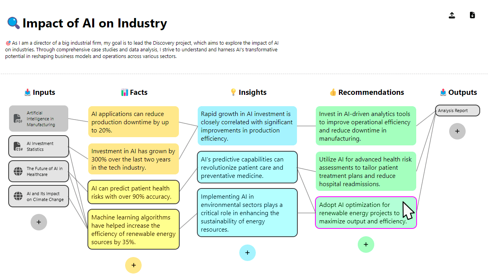

# Factly Frontend

A React-TypeScript single-page application implementing the **FIR methodology** (Facts, Insights, Recommendations) for structured discovery and decision-making.



## Overview

Factly provides a 5-column interactive workspace where users create **discoveries** and progressively build a traceability chain:

**Inputs** → **Facts** → **Insights** → **Recommendations** → **Outputs**

Each entity links to its predecessors, forming a fully traceable path from raw data to actionable deliverables.

## Tech Stack

| Category | Technology |
|----------|------------|
| Framework | React 18 + TypeScript 5 |
| Build | Create React App (react-scripts) |
| Routing | React Router v6, use-query-params |
| Icons | FontAwesome v6 |
| Markdown | react-markdown |
| Styling | CSS custom properties (light/dark themes) |

## Project Structure

```
src/
├── App.tsx                  # Main app: discovery grid layout, state management
├── types.ts                 # Domain types (Input, Fact, Insight, Recommendation, Output)
├── config.ts                # API URL configuration
├── lib.ts                   # Utility functions (relations, highlighting)
├── components/
│   ├── *Item.tsx            # Individual entity cards (Input, Fact, Insight, etc.)
│   ├── *List.tsx            # Column containers for each entity type
│   ├── *Modal.tsx           # Create/edit dialogs for each entity type
│   ├── Toolbar.tsx          # Header toolbar (new/edit/import/export/room/theme)
│   ├── ItemWrapper.tsx      # Selection and hover highlighting wrapper
│   ├── TraceabilityModal.tsx # Full traceability chain viewer
│   ├── SuggestionsPanel.tsx # AI-powered suggestions (backend integration)
│   ├── Lines.ts             # SVG connection lines between entities
│   ├── Toast.tsx            # Notification component
│   └── ...
├── hooks/
│   └── useItemSelection.ts  # Multi-select state management
└── renderers/
    ├── MarkdownRenderer.tsx # Markdown-to-React rendering
    └── OutputRenderer.ts    # Output document generation
```

## Getting Started

### Prerequisites

- Node.js (LTS recommended)
- npm

### Installation

```bash
cd apps/frontend
npm install
```

### Development

```bash
npm start
```

Starts the development server at `http://localhost:3000` with hot reload.

### Build

```bash
npm run build
```

Produces an optimized production build in the `build/` directory.

### Test

```bash
npm test
```

Runs tests in interactive watch mode using Jest and React Testing Library.

## Environment Variables

| Variable | Default | Description |
|----------|---------|-------------|
| `REACT_APP_API_URL` | `http://localhost:3002` | Backend API endpoint |

No `.env` file is required for local development -- defaults are applied in `src/config.ts`.

## Features

### Discovery Management
- Create, edit, and manage discoveries with title, goal, and date
- Import/export discoveries as JSON files
- Example discovery available for new users

### Entity Operations
- Add, edit, and delete inputs, facts, insights, recommendations, and outputs
- Create and remove relationships between entities
- Multi-select items with per-column selection toolbars

### Traceability
- Visual SVG connection lines between related entities
- Hover an item to highlight its full traceability chain
- Traceability modal shows backward and forward relationships for any item

### Collaboration
- Create live shared rooms for real-time collaborative sessions
- Join rooms via URL with unique user identity
- Real-time sync via Server-Sent Events (SSE)

### Theming
- Light and dark mode toggle
- CSS custom properties for consistent theming across all components

## Docker

The app includes a multi-stage Dockerfile (Node.js build, then nginx for serving).

**Runtime environment variable:**

| Variable | Default | Description |
|----------|---------|-------------|
| `BACKEND_URL` | `http://backend:3002` | Backend service URL for nginx reverse proxy |

nginx proxies `/status`, `/rooms`, `/events`, and `/extract` to the backend.

## License

[MIT](./LICENCE)
