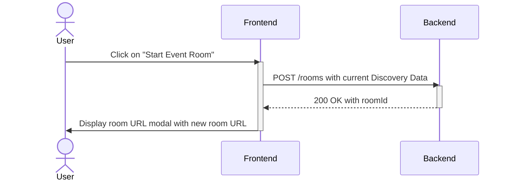
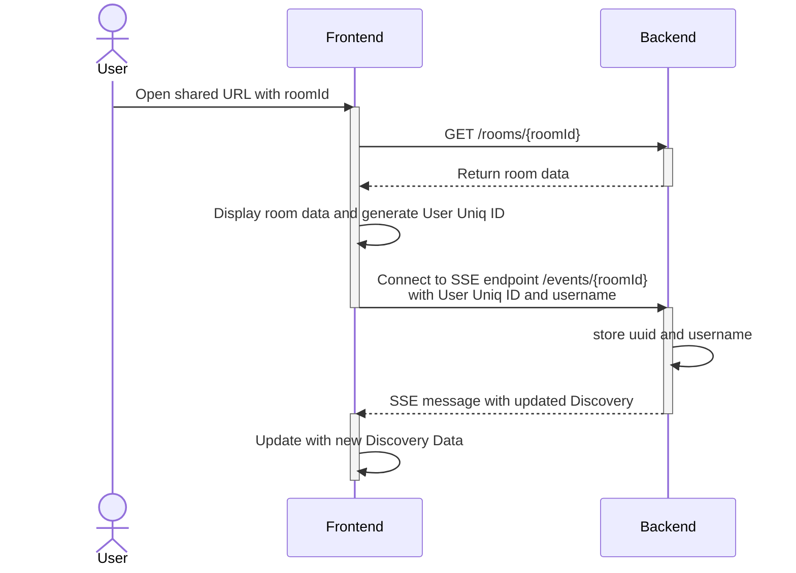

## Start Live Room

```mermaid
sequenceDiagram
    Actor User
    participant Frontend
    participant Backend

    User->>Frontend: Click on "Start Event Room"
    activate Frontend
    Frontend->>Backend: POST /rooms with current Discovery Data
    activate Backend
    Backend-->>Frontend: 200 OK with roomId 
    deactivate Backend
    Frontend->>User: Display room URL modal with new room URL
    deactivate Frontend

```

## Join Live Room

```mermaid
sequenceDiagram
    Actor User
    participant Frontend
    participant Backend

    User->>Frontend: Open shared URL with roomId
    activate Frontend
    Frontend->>Backend: GET /rooms/{roomId}
    activate Backend
    Backend-->>Frontend: Return room data
    deactivate Backend
    Frontend->>Frontend: Display room data and generate User Uniq ID
    Frontend->>Backend: Connect to SSE endpoint /events/{roomId} <br> with User Uniq ID and username
    deactivate Frontend
    activate Backend
    Backend->>Backend: store uuid and username
    Backend-->>Frontend: SSE message with updated Discovery
    deactivate Backend
    activate Frontend
    Frontend->>Frontend: Update with new Discovery Data
    deactivate Frontend
```