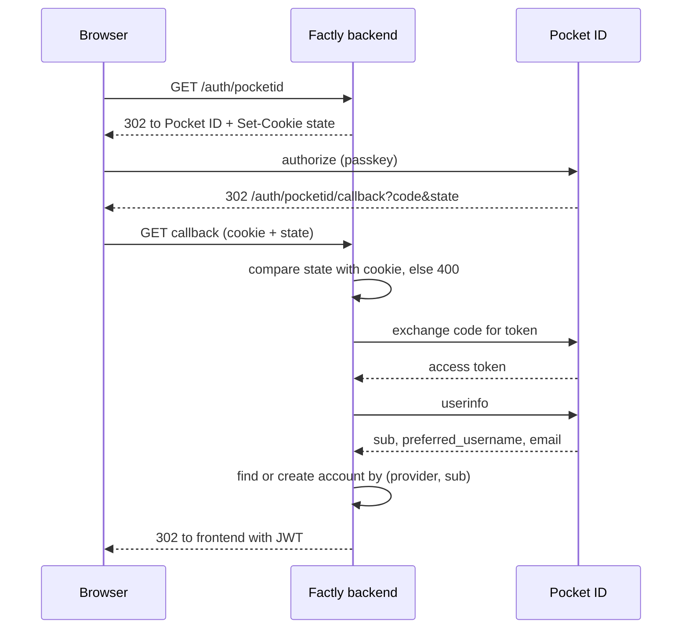

# Federated Identity — Technical Specification

- **x-tsid:** TS-FederatedIdentity
- **x-fsid-links:**
  - FS-FederatedProvidersListed
  - FS-FederatedProviderNotConfigured
  - FS-FederatedSignInRedirectsToProvider
  - FS-FederatedFirstSignInCreatesAccount
  - FS-FederatedReturningSignInReusesAccount
  - FS-FederatedSignInRejectsForgedState
  - FS-FederatedSignInRejectsMissingCode
  - FS-SelfRegistrationRefused

## Overview

Factly delegates sign-in to an external identity provider. Pocket ID
(`https://id.betafactory.co`) is the provider for the deployed instance; GitHub
and Google remain supported through the same code path.

Two things change beyond adding a provider:

1. The authorization flow gains a `state` parameter. Without one, any site can
   complete a sign-in in a visitor's browser and silently seat them in an
   account the attacker controls — everything they then write goes somewhere the
   attacker can read. The flow already in the codebase omitted it.
2. `POST /auth/register` is withdrawn. Accounts now come from the CLI or from an
   identity provider, which is what `UBIQUITOUS_LANGUAGE` and the functional
   spec's non-goals have always said.

## Provider configuration

Pocket ID is a standards-compliant OIDC provider, so its three endpoints derive
from one issuer URL rather than being hard-coded per provider:

| Variable | Required | Meaning |
| --- | --- | --- |
| `OAUTH_POCKETID_ISSUER_URL` | yes | Origin of the provider, e.g. `https://id.betafactory.co` |
| `OAUTH_POCKETID_CLIENT_ID` | yes | Client ID issued by Pocket ID |
| `OAUTH_POCKETID_CLIENT_SECRET` | yes | Client secret issued by Pocket ID |

Derived endpoints:

- authorization: `${issuer}/authorize`
- token: `${issuer}/api/oidc/token`
- userinfo: `${issuer}/api/oidc/userinfo`

The provider is offered only when all three variables are set. A provider that
is not configured answers `503`; it is never partially enabled.

## Cross-site request forgery defence

`GET /auth/:provider` mints 32 bytes of random, hex-encoded state and sets it as
a cookie before redirecting:

```
Set-Cookie: factly_oauth_state=<hex>; HttpOnly; Secure; SameSite=Lax; Path=/auth; Max-Age=600
```

`SameSite=Lax` is required rather than `Strict`: the callback is a cross-site
top-level navigation back from the provider, and `Strict` would withhold the
cookie exactly when it is needed. `Path=/auth` keeps it off every other request.

`GET /auth/:provider/callback` compares the `state` query parameter against the
cookie in constant time, clears the cookie, and rejects a mismatch or an absent
cookie with `400`. No token is issued and no account is created on rejection.

## Token exchange encoding

The code exchange is posted as `application/x-www-form-urlencoded`, which is
what OAuth 2.0 requires. The implementation being extended posted JSON; GitHub
tolerates that, but Pocket ID advertises only `client_secret_basic` and
`client_secret_post`, and Google rejects it — so the Google flow as shipped
could not have completed. Form encoding is correct for all three providers.

## Account mapping

The identity claim is the provider's stable subject (`sub` for OIDC, `id` for
GitHub). Accounts are keyed on `(provider, subject)`, never on email or
username — both are mutable at the provider and reusable across people, so
keying on either lets one person inherit another's discoveries.

A first sign-in creates `pocketid:<preferred_username>`; a returning sign-in
resolves the existing account by subject and creates nothing.

## Sequence



## Withdrawn endpoint

`POST /auth/register` returns `404` and creates nothing. It is removed rather
than gated so that no configuration mistake can reopen it.

## Frontend

`GET /auth/providers` already tells the sign-in page which providers to offer;
`pocketid` joins that list and renders as a "Sign in with Pocket ID" button.
No change to the callback handling: the existing `loginWithToken` path is reused.

## Non-goals

- Single logout: signing out of Factly does not end the Pocket ID session.
- Group or role claims: Pocket ID groups are not read, and every account has the
  same rights.
- Account linking: the same person signing in through two providers gets two
  accounts.
